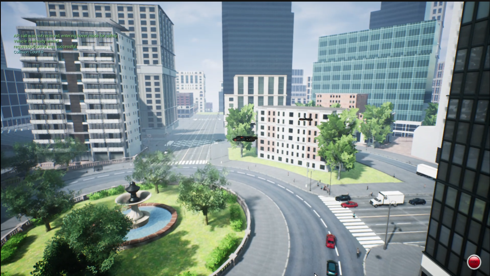
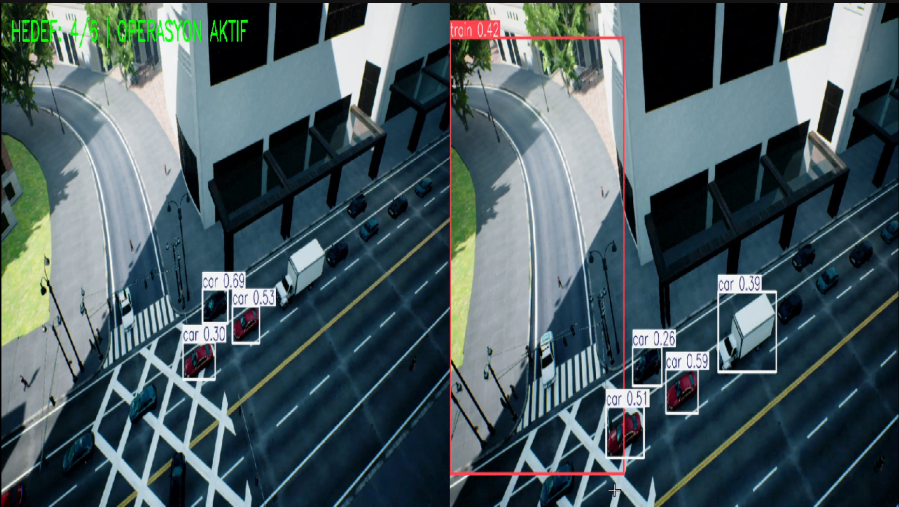
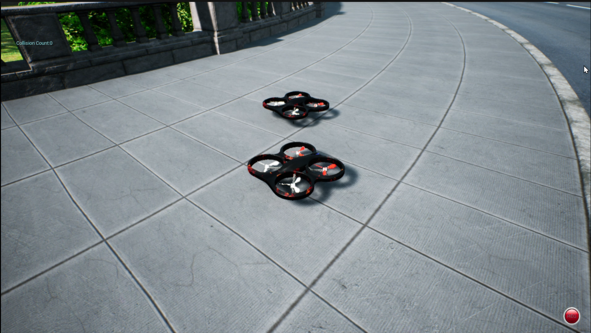

# Coordinated Dual-UAV Patrol with YOLOv8 in AirSim

A simulation-based dual-UAV patrol and aerial monitoring system developed with **Microsoft AirSim, Python, OpenCV, and YOLOv8**.

The project demonstrates two UAVs moving through a shared waypoint-based patrol route with a predefined spatial offset while their onboard camera streams are processed independently with YOLOv8 for real-time object detection.

<p align="center">
  
</p>

<p align="center">
  <em>Two UAVs moving through the simulated urban environment during the coordinated patrol mission.</em>
</p>

---

## Overview

This project combines **multi-UAV coordination, waypoint-based navigation, aerial monitoring, and real-time computer vision** in a simulated urban environment.

The system uses two AirSim UAVs:

- `D1` follows the primary patrol route.
- `D2` follows the same waypoint sequence with a predefined positional offset.
- Both UAVs capture camera images during the mission.
- YOLOv8 processes each camera stream independently for object detection.
- Both processed feeds are displayed side-by-side using OpenCV.
- The system includes a route-aware return-to-base procedure.
- A controlled landing sequence is executed at the end of the mission.

The goal of the project is to experiment with the integration of **UAV control, coordinated movement, and real-time visual perception**.

---

## Key Features

- Dual-UAV simulation in Microsoft AirSim
- Shared waypoint-based patrol route
- Predefined spatial separation between UAVs
- Real-time camera acquisition from both drones
- YOLOv8 object detection
- Bounding-box and confidence visualization
- Dual-camera monitoring interface
- Route-aware return-to-base behavior
- Controlled vertical landing
- AirSim API-based UAV control

---

## System Flow

```text
System Initialization
        |
        v
Dual-UAV Takeoff
        |
        v
Camera Orientation
        |
        v
Waypoint Patrol
        |
        +-----------------------+
        |                       |
        v                       v
      UAV D1                  UAV D2
        |                       |
        v                       v
  Camera Stream           Camera Stream
        |                       |
        v                       v
 YOLOv8 Detection        YOLOv8 Detection
        |                       |
        +-----------+-----------+
                    |
                    v
           Dual-Camera Display
                    |
                    v
        Patrol / Return-to-Base
                    |
                    v
           Controlled Landing
```

---

## Dual-UAV Coordination

The patrol mission is based on six predefined AirSim waypoints.

```python
devriye_noktalari = [
    (100, 0, -27, 5),
    (100, 40, -27, 5),
    (10, 80, -27, 5),
    (-70, 80, -27, 5),
    (-70, -10, -27, 5),
    (0, 0, -27, 5)
]
```

Each tuple contains:

```text
(x, y, z, speed)
```

Both UAVs receive related waypoint commands.

A predefined positional offset is applied to `D2`:

```python
offset = 5 if drone_name == "D2" else 0
```

The resulting movement strategy is:

```text
D1 -> Primary Waypoint
D2 -> Primary Waypoint + Spatial Offset
```

This allows the two UAVs to move through the environment in a coordinated configuration instead of occupying exactly the same trajectory.

Both vehicles are commanded using the same patrol speed.

### Coordination Scope

This implementation demonstrates **waypoint-based multi-UAV coordination**.

It does not currently implement:

- swarm intelligence,
- decentralized multi-agent decision-making,
- or closed-loop formation control.

The relative arrangement is created through predefined waypoint offsets.

---

## Real-Time YOLOv8 Object Detection

Both UAVs provide RGB camera streams through the AirSim camera API.

The project uses the **YOLOv8 Nano** model through the Ultralytics framework:

```python
model = YOLO('yolov8n.pt')
```

For each UAV:

1. A camera frame is captured from AirSim.
2. The frame is converted into a NumPy array.
3. The image is resized for visualization.
4. YOLOv8 performs object detection.
5. Detection results are rendered on the frame.
6. The two UAV feeds are displayed side-by-side.

<p align="center">
  
</p>

<p align="center">
  <em>Real-time YOLOv8 object detection from both simulated UAV camera feeds.</em>
</p>

The monitoring interface can display:

- detected object classes,
- bounding boxes,
- confidence values,
- both UAV camera perspectives,
- and the current patrol waypoint.

---

## Perception and Navigation

The perception and flight-control components are intentionally separate in the current implementation.

YOLOv8 is used for:

- visual monitoring,
- scene understanding,
- and object detection.

YOLO detections do **not** directly control the UAV navigation logic.

UAV movement is determined by the predefined waypoint route and AirSim movement commands.

This means the current architecture can be represented as:

```text
Camera -> YOLOv8 -> Visual Monitoring

Waypoint Route -> UAV Control
```

A future version could connect perception results to mission decisions or navigation behavior.

---

## Camera Configuration

After takeoff, both UAV cameras are tilted downward to provide a better aerial view of the simulated urban environment.

The camera orientation is configured using the AirSim API:

```python
radyan_aci = math.radians(-45)
```

This provides a suitable perspective for monitoring roads, vehicles, and other objects below the UAVs.

---

## Patrol Control

The current implementation uses two keyboard commands during the mission:

### `N` — Next Waypoint

Advances the patrol to the next predefined waypoint.

Waypoint progression is manually triggered in the current version.

Once the next waypoint is selected, movement toward that position is handled through the AirSim UAV control API.

### `Q` — Return to Base

Interrupts the patrol and initiates the return-to-base procedure.

---

## Return-to-Base Procedure

The system includes a route-aware return behavior.

When the return command is triggered, the UAVs do not simply fly directly toward the starting point.

Instead, they traverse the previously visited patrol waypoints in reverse order.

Conceptually:

```text
Current Waypoint
      |
      v
Previous Waypoint
      |
      v
Previous Waypoint
      |
      v
Patrol Start
      |
      v
Base Position
```

During the return procedure, the position of `D1` is monitored to determine when the system is close enough to continue toward the next return waypoint.

After completing the reverse route:

- `D1` approaches its base position.
- `D2` approaches its corresponding offset base position.
- The landing sequence begins.

---

## Controlled Landing

Before landing, both UAVs enter a stabilization stage.

The system:

1. Commands both UAVs to hover.
2. Reads their current positions.
3. Maintains their horizontal position.
4. Initiates a controlled vertical descent.
5. Continuously monitors altitude.
6. Disarms both UAVs after landing.
7. Releases AirSim API control.

<p align="center">
  
</p>

<p align="center">
  <em>Both UAVs after completing the simulated mission and landing sequence.</em>
</p>

---

## Technologies

| Technology | Purpose |
|---|---|
| Python | Main implementation |
| Microsoft AirSim | UAV simulation and flight control |
| YOLOv8 | Real-time object detection |
| Ultralytics | YOLO inference framework |
| OpenCV | Camera visualization and monitoring interface |
| NumPy | Image and numerical processing |

---

## Project Structure

```text
UAV-Autonomous-Patrol-YOLOv8/
│
├── assets/
│   ├── 01-coordinated-flight.png
│   ├── 02-yolov8-monitoring.png
│   └── 03-landing.png
│
├── models/
│   └── yolov8n.pt
│
├── src/
│   └── droneKodAsil.py
│
├── .gitignore
└── README.md
```

---

## Installation

Python dependencies used by the project include:

```bash
pip install airsim numpy opencv-python ultralytics
```

A working Microsoft AirSim environment configured with two multirotor vehicles named:

```text
D1
D2
```

is also required.

The AirSim environment and simulator configuration are not included in this repository.

---

## YOLO Model

The project uses:

```text
YOLOv8 Nano
```

A model weight file is included under:

```text
models/yolov8n.pt
```

The current Python script initializes the model using:

```python
YOLO('yolov8n.pt')
```

Therefore, the YOLO weight file must be accessible to Ultralytics from the environment in which the script is executed.

---

## Current Scope

This project is a **simulation-based prototype** developed for learning and experimentation with:

- UAV systems
- Multi-UAV coordination
- Waypoint-based navigation
- Computer vision
- Real-time object detection
- Aerial monitoring
- Autonomous-systems workflows

The current version is not intended to represent a production-ready real-world UAV control system.

---

## Current Limitations

The current implementation has several intentionally simple components:

- Waypoint transitions are manually triggered.
- UAV coordination uses a predefined positional offset.
- YOLO detections do not influence navigation.
- Formation errors are not corrected using closed-loop feedback.
- Obstacle avoidance is not currently integrated.
- Return-route progression is primarily monitored using `D1`.

These limitations provide clear directions for future development.

---

## Future Improvements

Possible extensions include:

- Automatic waypoint progression based on UAV position
- Closed-loop formation control
- Dynamic UAV separation
- Inter-UAV collision avoidance
- LiDAR-based environmental awareness
- Obstacle avoidance
- Perception-driven UAV behavior
- Detection-based mission decisions
- Automatic mission planning
- Support for additional UAVs
- Dynamic patrol routes
- More advanced multi-UAV coordination strategies

---

## Screenshots

The screenshots shown in this README were captured from the original recorded simulation run.

Some interface labels visible in the recording are from the original prototype. User-facing interface text in the public source code was later standardized to professional English terminology without changing the underlying UAV movement, waypoint, YOLO, return-to-base, or landing logic.

---

## Author

**Ömer Faruk Sarıkaya**

Computer Engineering student focused on **Artificial Intelligence, Autonomous Systems, Machine Learning, and UAV technologies**.

---

## Disclaimer

This project was developed for educational, simulation, and autonomous-systems experimentation purposes.
